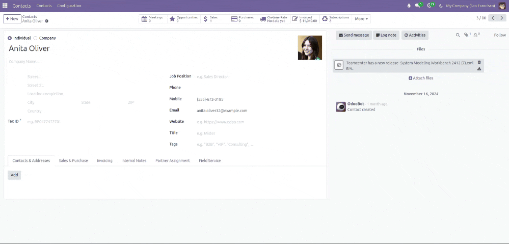

# Email Attachment Preview Module for Odoo

## Overview

The **Email Attachment Preview Module** for Odoo allows users to preview email attachments directly within the Odoo interface. When an email attachment is clicked, a preview is displayed, providing a quick and convenient way to view the content without downloading the file. This feature enhances user experience by streamlining the process of accessing and reviewing email attachments.

## Features

- **Seamless Email Attachment Preview**: View attachments without downloading.
- **Bootstrap Integration**: Uses Bootstrap for a modern and responsive UI.
- **Custom Styling**: Designed for a clean and professional look.
- **Odoo Compatibility**: Works efficiently within the Odoo framework.

## Demo

## Availability

This module is **private** and available for purchase on the Odoo App Store. You can find it here:
[Odoo App Store - Email Attachment Preview](https://apps.odoo.com/apps/modules/17.0/synksl_email_attachment_preview)

## Services

We offer a range of Odoo-related services:

- **Odoo Customization**
- **Odoo Implementation**
- **Odoo Support**
- **Hire Odoo Developer**
- **Odoo Integration**
- **Odoo Migration**
- **Odoo Consultancy**
- **Odoo Training**
- **Odoo Licensing**

## Contact

For inquiries or support, reach out to us:

**📧 Email: [burnaviour7890@gmail.com](mailto:burnaviour7890@gmail.com)**

**🔗 Link**edIn: [Muhammad Muzafar](https://www.linkedin.com/in/muhammad-muzafar-78147b213/)

